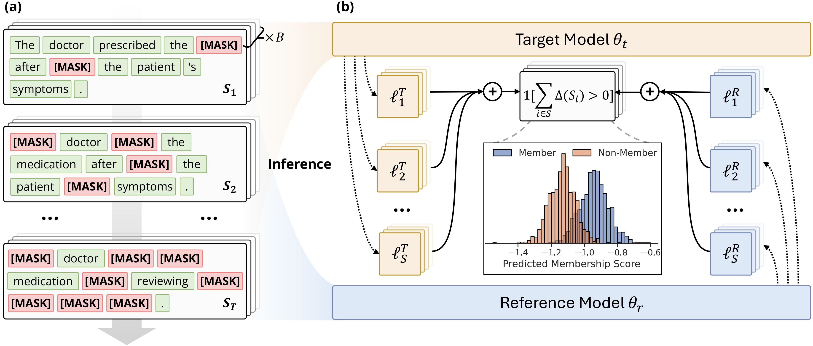

# ITS: Membership Inference Attacks on Fine-tuned Diffusion Language Models

> **Status:** paper title, authors and arXiv ID are placeholders — fill them in
> before publishing this repository. The method referred to as **ITS** in this
> repository was developed on top of the SAMA baseline (Chen et al., 2026).

[](https://www.python.org/downloads/)

This repository contains the implementation of **ITS** and a set of baseline
membership-inference attacks for evaluating privacy leakage of fine-tuned
**Diffusion Language Models** (DLMs) such as [LLaDA](https://huggingface.co/GSAI-ML/LLaDA-8B-Base)
and [Dream](https://huggingface.co/Dream-org/Dream-v0-Base-7B).

<p align="center">
  <a href="res/pipe.jpg">
    
  </a>
  <br>
  <em>Overview of the ITS pipeline.</em>
</p>

## What is ITS?

ITS reframes the membership-inference test as an **attention-aware,
diversity-constrained subset-sampling** problem on top of the SAMA framework.
Concretely, given a target fine-tuned DLM and a pre-trained reference DLM:

1. **Token-importance graph.** Run the *reference* DLM on the unmodified text
   once and keep the multi-layer self-attention to build an L×L token
   adjacency matrix.
2. **Diverse subset sampling.** For each of the `steps` progressive masking
   rounds, draw `num_subsets` disjoint groups of `subset_size` tokens using a
   graph sampler with an internal-connectivity coefficient (`sample_alpha`)
   and a cross-subset diversity penalty (`lambda_penalty`) — see
   `sample_engine` in [`attack/attacks/its.py`](attack/attacks/its.py).
3. **Per-subset loss comparison.** Mask the sampled tokens on both the target
   and reference models in parallel; record the per-token cross-entropy on the
   newly masked positions.
4. **Vote + aggregate.** Each subset votes `ref_loss > target_loss`; votes are
   averaged inside a step, and the mean across steps becomes the final
   membership score.

## Repository Structure

```
.
├── trainer/                    # DLM fine-tuning module
│   ├── model/
│   │   ├── llada/              # LLaDA-8B architecture files
│   │   └── dream/              # Dream-v0-Base-7B architecture files
│   ├── misc/                   # data.py, env_setup.py, models.py, trainer.py, utils.py
│   ├── configs/                # Core training YAMLs (see below)
│   ├── run.py                  # accelerate launch entrypoint
│   ├── run_train.sh            # Consolidated training launcher
│   └── requirements.txt
│
├── attack/                     # Membership-inference attacks
│   ├── attacks/                # Attack implementations
│   │   ├── its.py              # ← proposed method (ITS)
│   │   ├── sama.py             # SAMA baseline (Chen et al., 2026)
│   │   ├── loss.py, ratio.py, zlib.py           # NLL / Loss-Calibration / Zlib
│   │   ├── dfmia.py, mink.py, minkpp.py         # DF-MIA, Min-K, Min-K++
│   │   └── utils.py
│   ├── configs/                # YAMLs for LLaDA-8B targets
│   ├── configs_dream/          # YAMLs for Dream-7B targets
│   ├── misc/                   # attack.py, config.py, dataset.py, io.py, metric.py, models.py, ...
│   ├── run.py                  # Attack entrypoint: python -m attack.run
│   └── run_attack.sh           # Consolidated attack launcher
│
└── dataset/                    # Dataset preparation utilities
    └── prep.py, prep_mimir.py
```

## Requirements

### Environment Setup

```bash
conda create -n its python=3.8
conda activate its

pip install -r trainer/requirements.txt
pip install -r attack/requirements.txt   # if present, otherwise see attack/misc
```

### Environment Variables

| Variable | Used in | Default |
|---|---|---|
| `SAMA_DATASET_PATH` | dataset prep helpers | `./` |
| `SAMA_METADATA_DIR` | `attack/attacks/its.py`, `attack/attacks/sama.py` | `./` |
| `SAMA_WANDB_PROJECT` | `trainer/configs/prep.py` | `Diff_LLM` |
| `SAMA_WANDB_GROUP` | `trainer/configs/prep.py` | `SAMA` |
| `HF_TOKEN` | `attack/attacks/sama.py`, `attack/attacks/ratio.py` | empty |

## Usage

### 1. Prepare datasets

```bash
python dataset/prep_mimir.py                # MIMIR benchmark
python dataset/prep.py                      # wikitext / ag_news / xsum
```

### 2. Fine-tune a target DLM

Use the consolidated launcher:

```bash
# LLaDA-8B on MIMIR arxiv (4 epochs, 2 GPUs)
./trainer/run_train.sh 0,1 2 \
    LLaDA-8B-Base-pretrained-mimir-arxiv-epoch4.yaml

# Dream-7B on MIMIR arxiv (4 epochs, 2 GPUs)
./trainer/run_train.sh 2,3 2 \
    Dream-v0-Base-7B-pretrained-mimir-arxiv-epoch4.yaml
```

The four shipped training configs are:

- `trainer/configs/LLaDA-8B-Base-pretrained-mimir-arxiv.yaml`
- `trainer/configs/LLaDA-8B-Base-pretrained-mimir-arxiv-epoch4.yaml`
- `trainer/configs/Dream-v0-Base-7B-pretrained-mimir-arxiv.yaml`
- `trainer/configs/Dream-v0-Base-7B-pretrained-mimir-arxiv-epoch4.yaml`

Run `python trainer/configs/prep.py` to regenerate additional variants
(dataset, LoRA, etc.).

### 3. Run membership-inference attacks

```bash
./attack/run_attack.sh \
    LLaDA-8B-Base-pretrained-mimir-arxiv-4_12_1.0e-5_4_512 \
    config_its4-p0.1

# or, run the full baseline sweep + ITS in one go:
./attack/run_attack.sh \
    LLaDA-8B-Base-pretrained-mimir-arxiv-4_12_1.0e-5_4_512 \
    config_all config_its4-p0.1
```

For Dream targets, swap to the matching `configs_dream/` YAMLs.

Under the hood `run_attack.sh` calls:

```bash
python -m attack.run \
    -c attack/configs/<config_name>.yaml \
    --output ./attack_results/<exp_name>/<config_name> \
    --base-dir ./outputs/<exp_name> \
    --cache-dir ./attack_results/<exp_name>/cache
```

| Argument | Description |
|---|---|
| `-c, --config` | Path to attack configuration YAML (required) |
| `--output` | Directory to save results and metadata (required) |
| `--base-dir` | Base directory for resolving relative model/dataset paths |
| `--target-model` | Path to target model (overrides config) |
| `--lora-path` | Path to a LoRA adapter (overrides config) |
| `--seed` | Random seed (default `42`) |

## Attack Configurations

| Config (in `attack/configs/`) | Purpose |
|---|---|
| `config_its4-p0.1.yaml` | ITS at λ=0.1, 4 progressive-mask steps (recommended headline config) |
| `config_all.yaml` | Runs Loss, Loss-Calibration, Zlib, Sama and Its in one file |
| `config_dfmia.yaml` | DF-MIA baseline only |
| `config_mink.yaml`, `config_minkpp.yaml` | Min-K and Min-K++ baselines |

Mirror configs for Dream targets live in `attack/configs_dream/`.

### ITS YAML at a glance

```yaml
Its:
  module: "its"
  steps: 4                   # progressive-mask steps
  subset_size: 8             # tokens per vote
  num_subsets: 128           # subsets per step
  l_schedule: "linear"       # or "geometric"
  min_mask_frac: 0.05        # mask fraction at step 0
  max_mask_frac: 0.50        # mask fraction at the last step
  lambda_penalty: 0.1        # anti-coupling / diversity penalty
  weight_start_layer_ratio: 0
  weight_end_layer_ratio: 1  # use all layers' attention as token weights
  reference_model_path: "GSAI-ML/LLaDA-8B-Base"   # reference DLM
  batch_size: 8
  max_length: 512
  seed: 42
  save_metadata: false
```

## Method: SAMA Baseline (Chen et al., 2026)

SAMA ([`attack/attacks/sama.py`](attack/attacks/sama.py)) is the closest prior
work; it samples random token subsets at each step and compares per-subset
target-vs-reference loss sums. ITS keeps SAMA's overall progressive-mask
framework and replaces the *uniform* subset sampler with the attention-aware
graph sampler (`sample_engine`), which lets the attack focus its votes on the
tokens that are most informative for distinguishing members from non-members.

Refer to the SAMA paper for the original algorithm and theoretical guarantees:

```
@inproceedings{chen2026membership,
  title  = {Membership Inference Attacks Against Fine-tuned Diffusion Language Models},
  author = {Chen, Yuetian and Zhang, Kaiyuan and Du, Yuntao and Stoppa, Edoardo
            and Fleming, Charles and Kundu, Ashish and Ribeiro, Bruno and Li, Ninghui},
  year   = {2026},
  eprint = {2601.20125},
  archivePrefix = {arXiv},
}
```

## Other Baselines

| Baseline | File | Idea |
|---|---|---|
| Loss | `attack/attacks/loss.py` | Plain per-token NLL averaged over `mc_num` Monte-Carlo masks |
| Loss-Calibration | `attack/attacks/ratio.py` | NLL divided by the same NLL on a reference DLM |
| Zlib | `attack/attacks/zlib.py` | NLL divided by zlib compression entropy |
| DF-MIA | `attack/attacks/dfmia.py` | Reference-free score → pseudo-non-member calibration pool |
| Min-K | `attack/attacks/mink.py` | Mean of the top-`mink` highest per-token losses |
| Min-K++ | `attack/attacks/minkpp.py` | Min-K on top of label-normalised log-probabilities |

## Citation

This ITS repository is built on top of [Chen et al. (arXiv:2601.20125)](https://arxiv.org/abs/2601.20125).
Please cite that work alongside your own publication when using this code.
